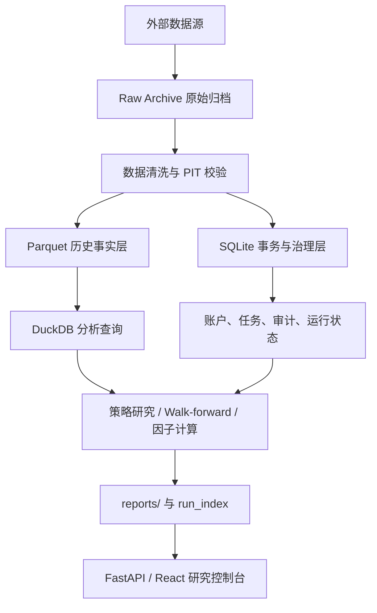

# SQLite 数据存储架构评估日志

- 日期：2026-08-14
- 类型：架构评估原文归档
- 决策状态：已采纳“SQLite 事务层 + Parquet/DuckDB 分析层”的分层混合存储作为最终目标
- 实施计划：`docs/archive/superpowers/plans/2026-08-14-hybrid-data-storage-migration.md`

以下为本轮评估回答原文，保留用于后续决策复查。

---

## 结论

**10GB 本身不是必须放弃 SQLite 的理由，但继续让项目“所有数据都统一放在 SQLite”已经不是长期最佳方案。**

我的明确建议是：

> **短期继续使用现有 SQLite，不做全库大迁移；中期改成分层混合存储：SQLite 管理事务和运行状态，Parquet + DuckDB 管理大型历史行情与因子分析数据。暂时不要整体迁移到 PostgreSQL。**

原因不是 SQLite 容量不够。SQLite 官方容量上限远高于 10GB；当前主库使用 4 KiB 页，理论容量边界以 TB 计，所以 9.23 GiB 距离格式上限还很远。

真正的问题是：

- 数据类型已经分化；
- 分析型宽表越来越大；
- 索引和备份成本明显增长；
- 动态网站和现有定时任务会增加并发；
- 当前所有代码都直接连接 SQLite，数据库职责开始混杂。

---

# 一、当前项目的实际状态

本次以只读方式检查了项目数据库。截至 **2026 年 8 月 14 日**：

| 数据库 | 当前体积 | 主要用途 |
|---|---:|---|
| `data/a_share_history.sqlite` | **9.23 GiB** | A 股日线、复权因子、估值、财务、指数数据 |
| `data/etf_history.sqlite` | 658 MiB | ETF 日线、因子、5 分钟数据 |
| `data/maintenance/maintenance.sqlite` | 400 MiB | 调度事件、运行状态 |
| `data/ai_corpus/ai_corpus.sqlite` | 约 50 MiB | 新闻与语料 |
| US/HK/Macro 等库 | 数 MiB 到十余 MiB | 跨市场、宏观数据 |

主库执行了：

```text
PRAGMA quick_check
```

结果为：

```text
ok
```

所以当前不是数据库损坏问题。

## 主库数据量

`data/a_share_history.sqlite` 当前包括：

- `market_daily_bars`：**27,371,467 行**
  - `bfq`：13,710,484 行
  - `qfq`：13,660,983 行
- `market_adj_factors`：13,828,325 行
- `market_daily_basic`：13,639,992 行
- `market_financial_factors`：193,972 行
- 股票数约 5,800 只
- 日线覆盖约为 2011-01-04 至 2026-08-14

数据库空间主要分布如下：

| 对象 | 空间 | 主库占比 |
|---|---:|---:|
| `market_daily_bars` 表 | 3.30 GiB | 35.7% |
| `market_daily_bars` 索引 | 1.33 GiB | 14.4% |
| `market_adj_factors` 表 | 1.03 GiB | 11.2% |
| `market_adj_factors` 索引 | 0.96 GiB | 10.4% |
| `market_daily_basic` 表 | 0.92 GiB | 9.9% |
| `market_daily_basic` 索引 | 1.16 GiB | 12.5% |
| 其他 | 0.54 GiB | 5.9% |

也就是说，约 **94%** 的空间集中在三个历史事实表及其索引。

---

# 二、当前性能是否已经出现问题

## 单股票时间区间查询仍然很好

典型查询：

```text
某一股票 + 日期范围 + adjust_type
```

现有索引可以正确命中：

```text
idx_daily_symbol_date_adj
```

实测一个股票的数百行查询约：

```text
0.3 毫秒
```

因此对于：

- 单股票行情；
- 单策略按股票取历史；
- 点查；
- 小范围回放；

SQLite 目前仍然非常合适。

## 横截面和大范围分析开始显露成本

实测：

| 查询 | 耗时 |
|---|---:|
| 2026 年全部股票约 76 万行 | 约 1.08 秒 |
| 单交易日 5,540 只股票横截面 | 约 0.86 秒 |
| 单日行情连接 `daily_basic` | 约 1.05 秒 |
| 五年全市场按日期聚合 | 约 2.70 秒 |

这些性能目前还可以接受，不属于紧急事故。

但查询计划显示，全市场日期查询主要使用：

```text
(market, adjust_type)
```

索引，然后再过滤日期。也就是说，随着历史继续增长，横截面和长区间查询成本会近似随数据量增长。

当前结构更擅长：

```text
指定股票 → 查询时间序列
```

不太擅长：

```text
指定日期/日期区间 → 扫描全市场全部股票
```

而量化研究、因子构建、walk-forward、股票池和横截面排序，恰恰会大量使用第二种访问模式。

---

# 三、当前还有几个比“10GB”更具体的问题

## 1. 存在约 0.48 GiB 的重复索引

`market_adj_factors` 主键是：

```text
PRIMARY KEY (market, symbol, date)
```

SQLite 已经为它创建：

```text
sqlite_autoindex_market_adj_factors_1
```

但项目又创建了：

```text
idx_market_adj_factors_symbol_date
    ON market_adj_factors(market, symbol, date)
```

两者字段和顺序完全相同，各占约 **0.48 GiB**。

这是明确的重复索引。

删除重复索引后，SQLite 文件不会自动立刻缩小，只会形成可复用空闲页；如果需要归还磁盘空间，应在副本上执行安全重建或 `VACUUM INTO`，验证后再替换，不能直接对生产主库冒险操作。

## 2. 行情同时存储 bfq 和 qfq

日线表包含两套约 1,370 万行的数据：

- `bfq`
- `qfq`

同时还单独保存：

- `market_adj_factors`

而项目正式研究口径又强调 `qfq_asof`，它本质上需要原始价格和 as-of 可见复权因子。

长期可评估：

```text
bfq 原始价格
+
PIT 复权因子
→ 查询时生成 qfq_asof
```

而 `qfq_current` 可以作为缓存或派生数据，不一定必须永久和 `bfq` 等量保存。

但这里不能直接删除 qfq。必须先验证：

- 现有策略是否直接读取 qfq 行；
- 动态计算是否与旧结果完全一致；
- 性能是否满足 walk-forward；
- 浮点误差是否改变排名或交易边界。

## 3. 缺少查询统计信息

当前主库没有：

```text
sqlite_stat1
```

说明没有持久化的 `ANALYZE` 查询统计。

这不代表所有查询计划都错误，但随着索引和数据量增加，查询优化器缺少真实分布信息，未来更容易选到次优索引。

应在数据库副本上测试：

```text
PRAGMA optimize
ANALYZE
```

然后比较关键查询计划和耗时，而不是直接对当前主库修改。

## 4. 当前并发配置较弱

主库当前是：

```text
journal_mode = delete
```

项目代码中大量使用普通：

```python
sqlite3.connect(db_path)
```

但几乎没有统一配置：

- `busy_timeout`
- 只读连接 URI
- WAL
- 集中连接工厂
- 统一事务策略

SQLite 支持大量并发读，但写操作会串行化；当应用需要较多并发写入时，应考虑客户端/服务器型数据库。

WAL 可以让读操作与写操作更好地同时进行，但依然只有一个 writer，而且 WAL 检查点、大批量回填和长读事务仍需专门控制。

所以即使继续使用 SQLite，也不能只是“维持现状”。

## 5. 备份已经放大磁盘占用

当前存在：

- 主库：9.23 GiB
- 2026-08-08 backup v2：7.07 GiB
- 2026-08-08 backup：约 6.93 GiB

三份合计约：

```text
23.23 GiB
```

从 2026-08-08 的备份到 2026-08-14，主库增加约 **2.16 GiB、30.6%**。

这次增长主要来自历史范围从 2016 年扩展到 2011 年，明显包含一次性回填，不应直接外推为自然日增长速度。但它说明：

> 每次保留完整 SQLite 文件副本，会迅速扩大本地资产占用。

需要正式的备份保留、压缩和恢复验证策略。

## 6. 维护库也存在无界增长

`maintenance.sqlite` 当前约 400 MiB，其中：

- `maintenance_events` 占约 399 MiB；
- 约 468,000 条记录；
- 全部是 `tick_decision`；
- 时间范围为 2026-06-07 至 2026-08-14。

这说明不仅行情库需要治理，事件库也缺少：

- 保留周期；
- 聚合归档；
- 去重；
- 冷数据转储。

按当前增长速度简单外推，维护事件表一年可能达到约 2 GiB；这只是趋势估算，不是确定预测。

---

# 四、SQLite 还能不能继续用

## 可以继续用，但应该限定职责

SQLite 很适合项目中的以下数据：

### 1. 任务和运行状态

例如：

- `web_jobs`
- `run_index`
- scheduler registry
- backfill task
- source audit
- 小型运行元数据

这些数据：

- 需要事务；
- 写入频率不高；
- 单机使用；
- 需要方便审计；
- 不需要分布式扩展。

### 2. 模拟账户和订单账本

例如：

- 模拟账户；
- 订单事件；
- 每日账单；
- 恢复状态。

这些是典型事务数据，需要：

- 唯一约束；
- 原子更新；
- 精确查询；
- 数据一致性。

SQLite 很适合当前单用户环境。

### 3. 小型维度和配置快照

例如：

- 股票元数据；
- 交易日历；
- ETF catalog；
- 数据源运行记录；
- 小型策略运行索引。

这些没有必要迁移到更重的系统。

---

# 五、哪些数据不应该长期只依赖 SQLite

大型、追加为主、分析读取为主的历史事实表，更适合列式存储：

- `market_daily_bars`
- `market_adj_factors`
- `market_daily_basic`
- `market_index_bars`
- 未来可能增长的 ETF 分钟线；
- 大型特征矩阵；
- 回测中间面板数据。

这些数据的特点是：

- 很少逐行更新；
- 经常按日期区间批量读取；
- 经常只读取少数列；
- 经常进行横截面聚合；
- 数据量持续增长；
- 需要压缩和分区裁剪。

Parquet 是列式文件格式，DuckDB 可以对 Parquet 执行过滤下推和列裁剪，只读取查询需要的行组和列；这比 SQLite 行式存储更符合大型历史行情分析的访问方式。

---

# 六、推荐目标架构

## 分层混合存储



## SQLite 保留

建议继续使用 SQLite 的数据：

```text
data/control.sqlite
  ├─ web_jobs
  ├─ run_index
  ├─ maintenance_registry
  ├─ source_runs
  └─ data_quality_findings

data/simulated_trading/simulated_accounts.sqlite
  ├─ accounts
  ├─ orders
  ├─ fills
  ├─ positions
  └─ daily_ledger
```

不一定需要真的合并成一个数据库；图中只是职责分类。现有数据库可以先保留，避免无收益的大范围重构。

## Parquet + DuckDB 承担

建议逐步迁移：

```text
data/lake/a_share/
  ├─ daily_bars/
  │  ├─ year=2011/
  │  ├─ year=2012/
  │  └─ ...
  ├─ adjustment_factors/
  ├─ daily_basic/
  ├─ financial_factors/
  └─ index_bars/
```

分区优先按：

```text
dataset + year
```

不建议一开始按股票代码分区，否则会产生大量小文件。

DuckDB 作为：

- Parquet 查询引擎；
- 多表连接引擎；
- 横截面聚合引擎；
- pandas/Arrow 数据出口；
- 本地研究 SQL 接口。

DuckDB 本身也不应该替代账户和任务事务数据库。它主要解决分析查询，不是 Web 任务状态和账户订单的首选事务存储。

---

# 七、为什么不直接全部迁到 PostgreSQL

PostgreSQL 更适合：

- 多用户；
- 多个 Web 实例；
- 多个并发 writer；
- 远程访问；
- 细粒度权限；
- 高可用和持续备份；
- 长期服务化部署。

但当前项目仍是：

- 本地优先；
- 单用户；
- 单机；
- SQLite-first；
- 数据库是 local-only 资产；
- 主要压力来自分析扫描，不是高频事务。

整体迁移 PostgreSQL 会增加：

- 服务安装和启动；
- 用户和权限配置；
- 端口与网络管理；
- schema migration；
- 备份恢复；
- 版本升级；
- Web、CLI、scheduler 的连接管理；
- 现有大量 `sqlite3.connect()` 调用的迁移成本。

而且 PostgreSQL 仍然是行式数据库。它能改善并发事务，但未必是历史行情全表扫描和本地列式分析的最高 ROI 方案。

因此当前不推荐：

```text
所有 SQLite → PostgreSQL
```

推荐：

```text
大型分析事实表 → Parquet + DuckDB
事务状态数据 → 继续 SQLite
未来出现多用户并发写 → 再评估 PostgreSQL
```

---

# 八、建议的实施顺序

## P0：先治理现有 SQLite，不迁移

预计：2–4 天。

1. 建立数据库容量审计报告：
   - 文件大小；
   - 表大小；
   - 索引大小；
   - 行数；
   - 最大日期；
   - `quick_check`；
   - 备份数量和年龄。

2. 审计重复索引：
   - 首先验证并移除 `market_adj_factors` 的重复索引；
   - 在副本上重建；
   - 对关键查询做 `EXPLAIN QUERY PLAN` 回归。

3. 建立维护事件保留策略：
   - 详细事件保留 30–90 天；
   - 更老数据按天和任务聚合；
   - 归档后删除明细；
   - 验证状态页不依赖无限历史。

4. 建立备份策略：
   - 限制完整快照数量；
   - 备份后压缩；
   - 记录 checksum；
   - 定期执行实际恢复测试；
   - 不只证明“备份文件存在”。

5. 统一 SQLite 连接入口：
   - 只读连接使用 `mode=ro`；
   - 配置 `busy_timeout`；
   - 明确事务边界；
   - WAL 只在并发回归测试通过后启用；
   - 不要在每个模块自行决定连接参数。

## P1：做 Parquet + DuckDB 小范围对照实验

预计：3–5 天。

不要立即迁移 9.23 GiB 主库。先选择：

```text
market_daily_bars
2024-01-01 至 2026-08-14
```

建立一个实验数据集，比较：

1. 单股票十年区间；
2. 单日全市场横截面；
3. 两年全市场面板；
4. 日期聚合；
5. 与 `daily_basic` 连接；
6. `qfq_asof` 复权；
7. 写入、增量追加和分区替换；
8. 文件体积；
9. 峰值内存；
10. 备份与恢复耗时。

当前虚拟环境里没有安装 DuckDB 和 PyArrow，因此本次没有进行本地 Parquet 性能对照，不能把预期压缩比或性能提升表述成已验证结果。

建议只有在实验达到以下门槛时才继续：

- 存储至少减少约 30%；
- 横截面和大区间查询至少提升约 2 倍；
- 单股票点查没有不可接受退化；
- `qfq_asof` 结果与当前 SQLite 基准一致；
- 策略关键指标和交易日期完全一致；
- 增量更新可幂等恢复。

这些是建议的准入门槛，不是当前已经取得的结果。

## P2：增加存储适配层

不要让策略代码直接区分 SQLite 和 DuckDB。

建议建立：

```python
HistoryStore
├── SQLiteHistoryStore
└── DuckDBParquetHistoryStore
```

上层继续调用统一接口：

```text
load_daily()
load_daily_basic()
load_adjustment_factors()
load_index_bars()
```

这样可以：

- 同时运行新旧后端；
- 做 shadow comparison；
- 按配置切换；
- 失败时回退 SQLite；
- 避免一次修改所有策略。

## P3：分表迁移，而不是整库切换

推荐顺序：

1. `market_daily_bars`
2. `market_daily_basic`
3. `market_adj_factors`
4. `market_index_bars`
5. 财务因子
6. ETF 分钟线

每张表迁移必须验证：

- 行数；
- 主键唯一性；
- 日期覆盖；
- null 分布；
- 分区 checksum；
- 抽样数值；
- PIT/as-of 可见性；
- 策略结果；
- 运行时间；
- 回滚路径。

---

# 九、最终判断

| 问题 | 判断 |
|---|---|
| 10GB 是否超过 SQLite 能力 | **否** |
| 当前主库是否还能正常使用 | **能，且完整性检查通过** |
| 是否需要立即迁移 | **不需要** |
| 是否应该所有数据继续长期统一 SQLite | **不建议** |
| 是否应该全部迁移 PostgreSQL | **当前不建议** |
| 推荐方向 | **SQLite 事务层 + Parquet/DuckDB 分析层** |
| 当前最优先动作 | **索引、备份、事件保留和查询模式治理** |

一句话总结：

> **SQLite 当前没有“撑不住”，但项目已经到了应该按工作负载拆分存储职责的阶段：不要因为 10GB 恐慌式迁库，也不要因为还能运行就继续无限扩张单一 SQLite。**


---

## 后续决策修订：maintenance_events

2026-08-14 复核代码后，原文中“详细事件保留 30–90 天、归档后删除明细”不再作为 Storage P0 实施要求。`maintenance_events` 是维护调度器的 `tick_decision` 运维日志，不进入策略研究和回测输入，但历史记录对状态展示和事故回溯有价值。

修订后的 P0 边界：

- 不删除、不归档现有 `maintenance_events`；
- 不修改 `maintenance_runs`；
- 优先从源头减少每分钟重复写入；
- 将每任务当前状态与历史事件分离；
- 未来任何历史归档或删除必须独立审批，并先通过状态、恢复和审计等价验证。


### 最终确认：允许归档后删除维护事件明细

用户确认 `maintenance_events` 属于维护调度日志后，同意对历史明细执行受控归档和删除。最终边界为：默认保留 90 天、每任务保留最新事件、先 dry-run、按月压缩归档、校验行数和 SHA-256 后再删除；`maintenance_runs` 及所有策略、行情、政策、新闻和回测输入均不在删除范围。


---

## Storage P0 启动记录

2026-08-14 已在分支 `codex/data-storage-governance-p0-20260814` 的独立 worktree 启动 Storage P0：

- 新增只读 `db-capacity` CLI；
- 输出 JSON/Markdown 容量、备份、表/索引、可选行数/日期范围、`quick_check` 和冗余索引证据；
- 实际深度审计 14 个数据库、5 个命名备份，完整性错误为 0；
- 主库日线 27,371,467 行，范围 2011-01-04 至 2026-08-14；
- P0 未删除索引、未执行 `VACUUM`/`ANALYZE`、未改变 journal mode、未迁移或删除生产数据；
- 维护事件归档/删除已获原则同意，但仍需后续按 dry-run、压缩归档、行数/checksum 校验和保留每任务最新事件的测试门禁实施。
