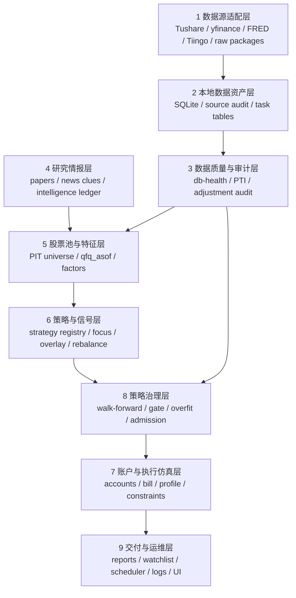
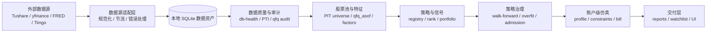
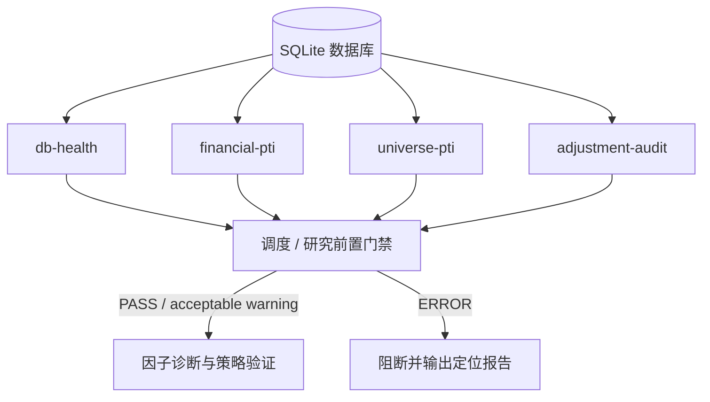
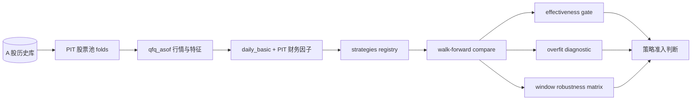
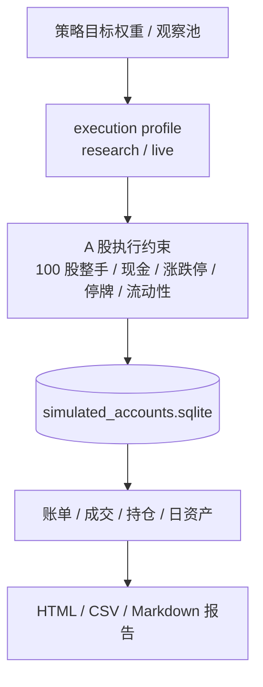
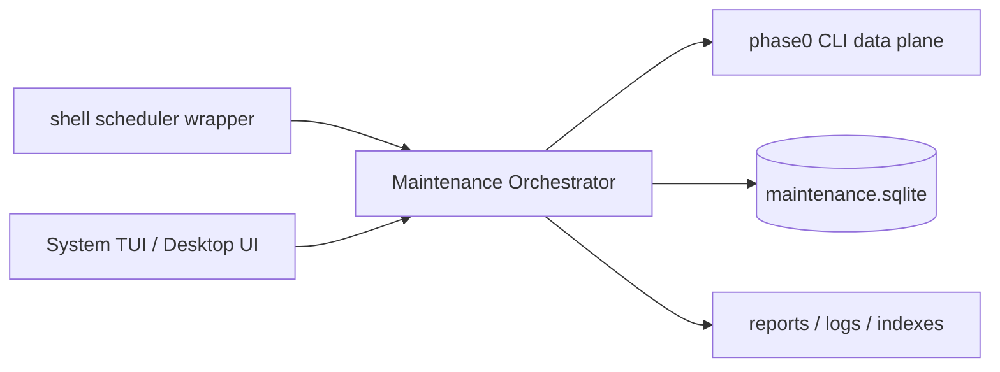
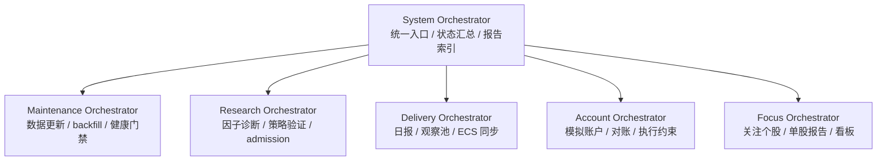
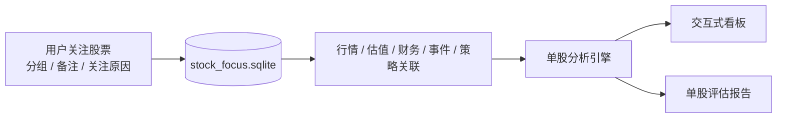
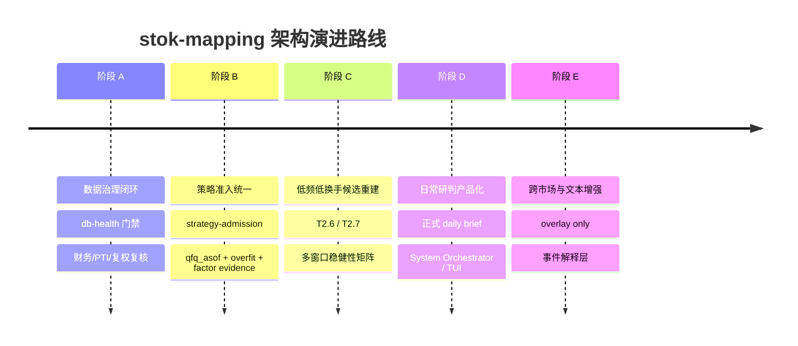

# stok-mapping

## 本地优先、可审计、可复现的 A 股量化研究系统

<div class="subtitle">
架构设计演示稿 · 2026-06-08
</div>

<div class="cover-grid">
  <div class="cover-card">数据治理</div>
  <div class="cover-card">因子研究</div>
  <div class="cover-card">策略验证</div>
  <div class="cover-card">账户仿真</div>
  <div class="cover-card">盘前研判</div>
  <div class="cover-card">本地工作台</div>
</div>

---
layout: two-cols
layoutClass: gap-12
---

# 一句话定位

`stok-mapping` 不是单一回测脚本，而是围绕 **A 股本土因子研究、数据治理、策略验证、账户级仿真和盘前研判交付** 构建的本地研究系统。

核心原则：

- 本地数据资产优先
- point-in-time 可见性优先
- 研究价格、执行价格、估值口径分离
- 策略结论必须经过治理门禁
- LLM 只做辅助解释，不进入主信号路径

::right::

# 当前阶段

<div class="status-card danger">
严格 qfq_asof + PIT 股票池复核后，当前没有可直接进入实盘模拟的合格策略。
</div>

<div class="status-card">
主线已从“维护 selected strategy”切换为“治理数据和因子，再重建有效候选”。
</div>

<div class="status-card">
优先推进：T2.5 因子诊断、T2.6/T2.7 低频质量策略、T2.8 策略准入报告。
</div>

---

# 产品边界

<div class="boundary-grid">
<div>

## 系统应该做

- 构建 A 股研究股票池
- 输出因子有效性诊断
- 执行 walk-forward 候选比较
- 生成策略准入与风险诊断报告
- 维护盘前观察池和模拟账户账本
- 输出数据源、数据质量、PIT、复权审计报告
- 支持关注个股分析和本地可视化工作台

</div>
<div>

## 系统不应该做

- 自动下单
- 接券商 API 实盘交易
- LLM 直接生成交易信号或调仓动作
- 对外投资建议或荐股服务
- 绕过数据质量、PIT、过拟合检查发布策略结论
- 将 `qfq_current` 历史结果解释为严格 PIT 回测

</div>
</div>

---

# 总体分层架构



<div class="note">
分层原则：下层不依赖上层；研究结论必须穿过数据质量与策略治理层；交付层只展示已生成结果。
</div>

---

# 端到端数据流



<div class="callout">
系统的事实来源是本地 SQLite、审计报告和可复现 CLI 产物，不是临时在线请求结果。
</div>

---
layout: two-cols
layoutClass: gap-10
---

# 本地数据资产

| 数据库 | 角色 |
|---|---|
| `a_share_history.sqlite` | A 股研究主库 |
| `us_market_history.sqlite` | US/FX/ETF/VIX 跨市场库 |
| `hk_market_history.sqlite` | HK 跨市场库 |
| `simulated_accounts.sqlite` | 模拟账户账本 |
| `maintenance.sqlite` | 维护编排状态库 |

::right::

# 数据资产原则

- SQLite 是正式研究底座，不是临时缓存
- 长任务回填必须可恢复、可分片、有限速、有审计
- 回测和日报尽量读本地库
- 跨市场数据先落库，再进入策略或报告
- 数据库不进入 Git
- 数据口径必须能被报告追溯

---

# 数据质量与审计层



关键检查：

- 表结构与字段完整性
- 最新交易日、覆盖率、滞后
- OHLC 异常、负成交量/金额
- 财务公告日 point-in-time
- 复权因子与 `qfq_asof` 可用性
- 跨市场 freshness 和 source audit

---

# 策略研究流



当前治理方向：

- `qfq_current` 只保留为兼容或对照口径
- 历史回测默认走 `qfq_asof` 与 PIT 股票池
- 财务因子必须通过 `announce_date <= as_of_date`
- 准入报告整合窗口稳健性、过拟合、换手和参数稳定性

---

# 策略治理门禁

<div class="gate-stack">
  <div>data health PASS / acceptable warning</div>
  <div>qfq_asof price safety</div>
  <div>PIT universe</div>
  <div>financial PTI PASS</div>
  <div>factor effectiveness evidence</div>
  <div>walk-forward gate</div>
  <div>overfit risk not high / critical</div>
  <div>account execution constraints</div>
  <div class="final">可进入观察池长期试用</div>
</div>

<div class="note">
单一 gate 通过不能代表策略可用。策略进入模拟或观察池前，必须穿过多维治理链路。
</div>

---
layout: two-cols
layoutClass: gap-10
---

# 策略与信号层

当前形态：

- `phase0/strategies/` 注册表结构
- 候选策略统一参与 compare
- portfolio 口径优先，避免 symbol-scope 混排
- 低频低换手质量策略正在重建
- 旧动量低换手策略降级为兼容基线和研究样本

::right::

# 主要风险

- `walk_forward.py` 职责偏宽
- 当前暂无通过严格准入的实盘模拟候选
- 低频质量策略仍需更长窗口和因子有效性支撑
- 参数稳定性、收益集中度和成本敏感性仍需增强
- 文本和跨市场信号不得过早进入主 ranker

---

# 账户与执行仿真层



边界：

- 账户层只做模拟、复盘和计划辅助
- 不接券商 API，不自动下单
- 未成交、部分成交和阻断原因必须显式记录

---

# 交付与运维层

| 入口 | 作用 |
|---|---|
| `brief watchlist` | 阶段试用观察池主入口 |
| `brief daily` | 当前日报入口 |
| `brief premarket` | 盘前观察池兼容入口 |
| `db-health` | 数据库健康检查与门禁 |
| `maintain status/run/stop/resume` | 维护编排器入口 |
| `strategy-admission` | 策略准入报告 MVP |

目标形态：



---

# 总体编排器规划



设计原则：

- System Orchestrator 只做统一入口和状态汇总
- 具体状态机留在领域子编排器
- 避免形成不可维护的单体超级编排器
- 优先落地维护编排器，再建设 TUI / Desktop overview

---
layout: two-cols
layoutClass: gap-10
---

# 本地桌面 UI 预留

定位：

- 本地研究工作台
- 运维控制台
- 报告库与数据治理入口
- 策略研究复核界面
- 观察池与模拟账户浏览器

不定位为：

- 交易终端
- 自动下单界面
- LLM 决策界面

::right::

# 推荐技术路线

首选：`Tauri + Web UI`

原因：

- Local-first，适合文件、SQLite、报告交互
- 比 Electron 更轻量
- Python CLI 和 SQLite 可以继续作为业务事实来源
- 权限可收窄到项目目录、报告目录和少量命令调用

第一版建议只读：报告库 + 数据治理控制台。

---

# 关注个股分析工具



边界：

- 关注表示研究兴趣，不表示策略选中或交易建议
- 工具回答“这只股票当前发生了什么、质量如何、风险在哪里、后续观察什么”
- 必须展示数据日期、价格口径、财务公告日和生成时间

---

# 关键数据口径

<div class="three-cols">
<div>

## 价格

- `bfq_raw`：执行与真实交易判断
- `qfq_current`：兼容和对照
- `qfq_asof`：严格历史特征

</div>
<div>

## 财务

- `report_date`：报告期
- `announce_date`：可见日
- 回测只读 `announce_date <= as_of_date`

</div>
<div>

## 股票池

- 当前股票池用于日报
- 历史回测使用 PIT folds
- 退市、ST、行业、市值、流动性按 as-of 处理

</div>
</div>

---

# 失败模式与防护

| 失败模式 | 当前防护 | 仍需增强 |
|---|---|---|
| Tushare 长任务中断 | 任务表、重试、分片、限速、进度 | 自动分片调度与原因聚合 |
| A 股日线覆盖不足 | source audit、db-health | 调度前置阻断增强 |
| 复权未来函数 | adjustment-audit、qfq_asof | 全链路回归验证 |
| 财务未来函数 | financial-pti、announce_date | 回填后持续复核 |
| 股票池未来函数 | PIT folds、universe-pti | admission 合并 |
| 策略过拟合 | overfit-diagnostic | 参数扰动、收益集中度 |
| 调度静默失败 | scheduler logs、db-health | 维护编排器统一状态库 |
| LLM 越权决策 | 文档边界 | 输出模板和 UI 权限强化 |

---

# 当前架构债务

## P0

- 统一 `strategy-admission` 仍需继续合并 qfq_asof、因子诊断和 execution gate
- 调度仍有 shell wrapper 遗留，需要维护编排器继续接管
- 严格口径下可进入模拟的候选策略仍为空

## P1

- `walk_forward.py` 职责过宽
- 正式 daily brief 仍需从 watchlist 兼容路径拆出
- 成本敏感性、参数扰动、收益集中度需要进一步量化

## P2

- feature store 仍未正式落地
- FRED/Tiingo/HK 尚未形成完整跨市场特征资产
- 真实账户 CSV 对账尚未闭环

---

# 演进路线



---
layout: two-cols
layoutClass: gap-10
---

# 推荐操作入口

```bash
# 数据库健康检查
./.venv/bin/python -m phase0.cli db-health \
  --config config.yaml --scope all

# 因子有效性诊断
./.venv/bin/python -m phase0.cli factor-effectiveness \
  --config config.yaml

# 策略过拟合诊断
./.venv/bin/python -m phase0.cli overfit-diagnostic \
  --config config.yaml

# 策略准入报告
./.venv/bin/python -m phase0.cli strategy-admission \
  --config config.yaml
```

::right::

# 架构验收标准

- 数据可追溯
- 结果可复现
- 口径可解释
- 异常可定位
- 任务可恢复
- 策略可审计
- 报告可交付
- UI 不成为新的事实来源

---
class: text-center
---

# 结论

<div class="final-statement">
当前最重要的架构方向不是更复杂的模型，而是把数据治理、策略准入、账户仿真和日常交付变成同一条可复现、可审计、可维护的工程链路。
</div>

<div class="end-grid">
  <div>Data First</div>
  <div>PIT First</div>
  <div>Governance First</div>
  <div>Local First</div>
</div>

---

# 附录：Slidev 运行方式

当前文件：

```text
docs/slides/project-architecture/slides.md
```

本地预览：

```bash
npx @slidev/cli docs/slides/project-architecture/slides.md
```

导出 PDF：

```bash
npx @slidev/cli export docs/slides/project-architecture/slides.md
```

如需长期维护，可后续把 `@slidev/cli` 加入 `devDependencies` 并配置 npm scripts。

<style>
:root {
  --c-bg: #f7f2e8;
  --c-ink: #16201d;
  --c-muted: #63706a;
  --c-accent: #c46a3a;
  --c-accent-2: #1c6b5a;
  --c-line: rgba(22, 32, 29, 0.14);
}

.slidev-layout {
  background:
    radial-gradient(circle at 8% 12%, rgba(196, 106, 58, 0.18), transparent 28%),
    radial-gradient(circle at 90% 18%, rgba(28, 107, 90, 0.16), transparent 32%),
    linear-gradient(135deg, #fbf7ef 0%, var(--c-bg) 55%, #efe6d6 100%);
  color: var(--c-ink);
  font-size: 0.92rem;
}

h1, h2, h3 {
  color: var(--c-ink);
  letter-spacing: -0.03em;
}

h1 {
  font-weight: 800;
}

.slidev-layout.cover h1,
.slidev-layout.text-center h1 {
  font-size: 4.2rem;
}

.subtitle {
  margin-top: 1rem;
  color: var(--c-muted);
  font-size: 1.1rem;
}

.cover-grid {
  display: grid;
  grid-template-columns: repeat(3, minmax(0, 1fr));
  gap: 0.75rem;
  margin: 3rem auto 0;
  max-width: 760px;
}

.cover-card,
.status-card,
.callout,
.note,
.gate-stack > div,
.end-grid > div {
  border: 1px solid var(--c-line);
  background: rgba(255, 252, 245, 0.72);
  box-shadow: 0 18px 50px rgba(55, 45, 31, 0.08);
  backdrop-filter: blur(10px);
}

.cover-card {
  padding: 1rem;
  border-radius: 18px;
  font-weight: 700;
}

.status-card {
  padding: 1rem 1.1rem;
  border-radius: 18px;
  margin-bottom: 1rem;
  text-align: left;
}

.status-card.danger {
  border-color: rgba(196, 106, 58, 0.42);
  background: rgba(255, 237, 224, 0.84);
}

.boundary-grid,
.three-cols {
  display: grid;
  grid-template-columns: repeat(2, minmax(0, 1fr));
  gap: 2rem;
}

.three-cols {
  grid-template-columns: repeat(3, minmax(0, 1fr));
}

.boundary-grid > div,
.three-cols > div {
  padding: 1.2rem;
  border-radius: 22px;
  border: 1px solid var(--c-line);
  background: rgba(255, 252, 245, 0.62);
}

.callout,
.note {
  margin-top: 1rem;
  padding: 0.9rem 1.1rem;
  border-radius: 18px;
  color: var(--c-muted);
}

.gate-stack {
  display: grid;
  grid-template-columns: repeat(4, minmax(0, 1fr));
  gap: 0.8rem;
  margin-top: 1.5rem;
}

.gate-stack > div {
  padding: 0.9rem;
  border-radius: 16px;
  font-weight: 700;
  text-align: center;
}

.gate-stack .final {
  grid-column: span 4;
  background: linear-gradient(135deg, rgba(28, 107, 90, 0.14), rgba(196, 106, 58, 0.14));
  border-color: rgba(28, 107, 90, 0.3);
  font-size: 1.2rem;
}

.final-statement {
  max-width: 880px;
  margin: 2rem auto;
  font-size: 1.8rem;
  line-height: 1.5;
  font-weight: 800;
}

.end-grid {
  display: grid;
  grid-template-columns: repeat(4, minmax(0, 1fr));
  gap: 0.8rem;
  max-width: 820px;
  margin: 2rem auto 0;
}

.end-grid > div {
  padding: 1rem;
  border-radius: 18px;
  font-weight: 800;
}

table {
  font-size: 0.72rem;
}

.slidev-code {
  font-size: 0.78rem;
  border-radius: 14px;
}

.mermaid {
  transform: scale(0.95);
  transform-origin: top center;
}
</style>
