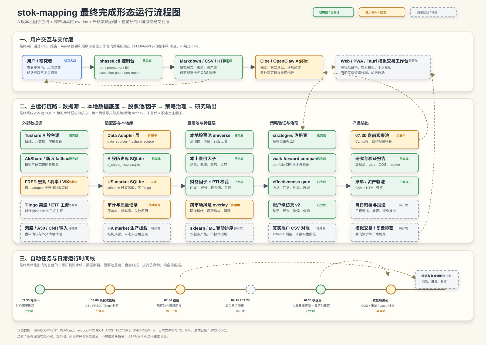

# stok-mapping 最终运行形态流程图

本文件用于演示项目最终完成后的运行形态，包含软件架构、模块关系、用户交互方式和自动任务流程。

查看图：

## 图例

- 绿色：已完成 / 已验证。
- 琥珀色：最小接入、过渡状态或仍需补齐稳定运行闭环。
- 灰色虚线：尚未启动或待开发。

## 状态口径

当前主线已经完成 A 股本土数据底座、股票池、策略注册表、walk-forward、effectiveness gate、账户级仿真、盘前观察池 CLI 和主要报告产物。

仍处于扩展或待开发的部分包括：FRED 从最小接入进入主链路、Tiingo 正式接入、美股/ETF 主源替换、港股生产挂载、每日简报自动投递、真实账户 CSV 对账、Web/PWA/Tauri 模拟交易工作台以及 sklearn/ML 辅助研究。
