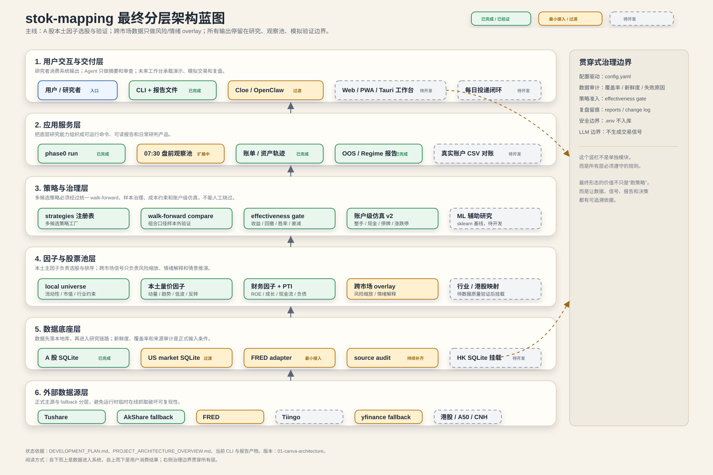

# 01 · Canva Architecture 风格

参考方向：

- https://www.canva.com/online-whiteboard/architecture-diagram/

这一版适合正式演示“系统最终架构”。它把项目拆成六层：

1. 用户交互与交付层
2. 应用服务层
3. 策略与治理层
4. 因子与股票池层
5. 数据底座层
6. 外部数据源层

查看图：

