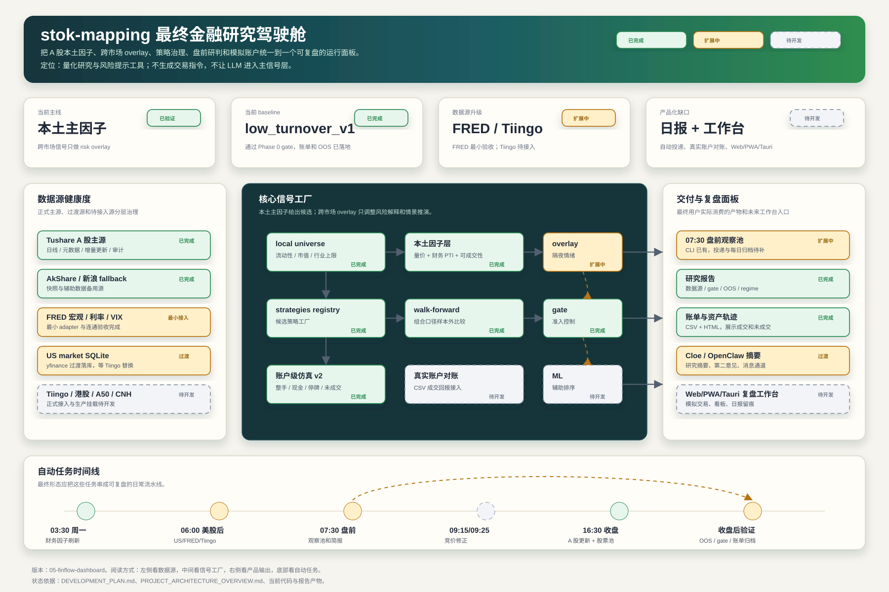

# 05 · FinFlow Dashboard 风格

参考方向：

- https://zellmarket.com/items/finflow-finance-dashboard-ui-kit/1187

这一版适合演示“最终产品像一个金融研究驾驶舱”。它不按传统流程图铺满节点，而是突出：

1. 今日运行状态
2. 数据源健康度
3. 核心信号工厂
4. 策略治理与模拟账户
5. 盘前输出与复盘闭环

查看图：

