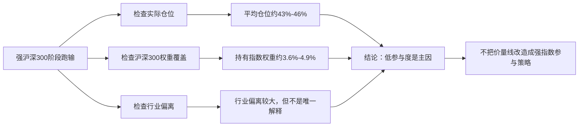

# Harness Iteration Brief - 2026-06-25 - I34 CSI300 权重归因

> 这份简报给人读，不替代原始 CSV、日志和研究报告。它的目标是说明：本轮发现了什么、证据是什么、下一步该怎么做。

## 一句话结论

`price_volume_low_turnover_v1` 在强沪深300阶段跑输，主要不是因为代码没法回测，而是因为它平均只用约 43% 到 46% 仓位参与市场，并且持有的沪深300指数权重只有约 3.6% 到 4.9%。它可以继续作为防守 / 选择性研究样本，但不能承担“强沪深300参与型”角色。

## 本轮做了什么

| 项目 | 内容 |
| ---- | ---- |
| 迭代编号 | `I34` |
| 任务性质 | research-only 归因工具 |
| 研究对象 | `price_volume_low_turnover_v1` 的 I10 日度持仓样本 |
| 运行日期 | `2026-06-25` |
| 数据日期 | 持仓样本覆盖 `2024-04-01` 至 `2026-03-31`；CSI300 权重表默认使用 `持仓日 - 1 天` 以前最近可见权重 |
| 关键边界 | 不生成买卖建议；不改变 admission；不改策略逻辑；不使用同日收盘后才可确认的权重 |

## 关键数字

| 折 | 样本天数 | 平均实际仓位 | 持有的沪深300权重 | 沪深300前20权重股覆盖率 | 策略收益 | 沪深300收益 | 超额 | 主要解释 |
| --- | ---: | ---: | ---: | ---: | ---: | ---: | ---: | --- |
| 4 | 241 | 42.57% | 3.64% | 2.65% | 8.62% | 9.89% | -1.27% | 仓位参与不足；保守权重口径下已小幅跑输 |
| 5 | 203 | 46.07% | 4.91% | 9.78% | 5.16% | 15.23% | -10.06% | 仓位参与不足，且高权重股覆盖太低 |

这些数字的意思很直接：策略不是完全没有收益，但在沪深300强的时候，它并没有买到沪深300上涨的主要驱动股票，也没有用足仓位。

## 最常错过的权重股

| 股票 | 行业 | 怎么理解 |
| ---- | ---- | -------- |
| 贵州茅台 | 白酒 | 两个强指数样本期长期未覆盖，平均指数权重最高 |
| 宁德时代 | 电气设备 | 强指数阶段的重要权重股，覆盖不足 |
| 中国平安 | 保险 | 长期未覆盖 |
| 招商银行 | 银行 | 长期未覆盖 |
| 美的集团 | 家用电器 | 覆盖不足 |
| 长江电力 | 水力发电 | 覆盖不足 |
| 紫金矿业 | 铜 | 覆盖不足 |
| 东方财富 / 中信证券 | 证券 | 金融风险偏好行情里覆盖不足 |

这不是说这些股票应该被买入，而是说明：当沪深300上涨主要由这些高权重股票推动时，这个策略天然跟不上。

## 图示

## 结论边界

| 问题 | 回答 |
| ---- | ---- |
| 是否改变 admission 结论 | 否。本轮只是归因，不是准入。 |
| 是否允许进入 paper review | 否。当前没有合格候选。 |
| 是否可以进入模拟账户 / 日报 / watchlist | 否。`price_volume_low_turnover_v1` 仍是 research-only。 |
| 是否说明策略没有价值 | 否。它仍可作为防守 / 选择性研究样本，但不适合强指数参与角色。 |
| 哪些地方还不能下结论 | 尚未把同一工具套到 I15/I18/I20 三个强市场失败候选；也没有做盘中择时或交易执行可行性验证。 |

## 下一步

1. 把 `strategy-csi300-attribution` 套到 I15/I18/I20 的日度持仓样本上，确认强市场参与型候选失败到底是空仓、低覆盖、行业偏离还是选股失败。
2. 若 I15/I18/I20 仍显示高权重覆盖不足，下一轮不要继续调触发器，而要预注册一个真正围绕 CSI300 权重和流动性的强市场候选。
3. 更新角色卡：`price_volume_low_turnover_v1` 在强沪深300环境下应降权或停用；正式工作流仍应输出“暂无合格强市场参与策略”。

## 原始证据

| 类型 | 路径 |
| ---- | ---- |
| Markdown 报告 | `reports/strategy_governance/2026-06-25/main_strategy_rnd_harness/evidence/iter_34__csi300_weight_attribution/strategy_csi300_attribution_report.md` |
| 日度归因 CSV | `reports/strategy_governance/2026-06-25/main_strategy_rnd_harness/evidence/iter_34__csi300_weight_attribution/strategy_csi300_daily_attribution.csv` |
| 折级归因 CSV | `reports/strategy_governance/2026-06-25/main_strategy_rnd_harness/evidence/iter_34__csi300_weight_attribution/strategy_csi300_fold_attribution.csv` |
| 遗漏权重股 CSV | `reports/strategy_governance/2026-06-25/main_strategy_rnd_harness/evidence/iter_34__csi300_weight_attribution/strategy_csi300_missed_top_weights.csv` |
| 行业主动权重 CSV | `reports/strategy_governance/2026-06-25/main_strategy_rnd_harness/evidence/iter_34__csi300_weight_attribution/strategy_csi300_industry_active_weights.csv` |
| 运行日志 | `reports/strategy_governance/2026-06-25/main_strategy_rnd_harness/evidence/iter_34__csi300_weight_attribution/strategy_csi300_attribution_run_log.md` |
| 测试结果 | `./.venv/bin/python -m pytest -s tests/test_strategy_csi300_attribution.py`，结果：`4 passed` |
| 会话归档 | `reports/strategy_governance/2026-06-25/main_strategy_rnd_harness/session_archive/session_incremental_archive_20260625_1005.md` |
