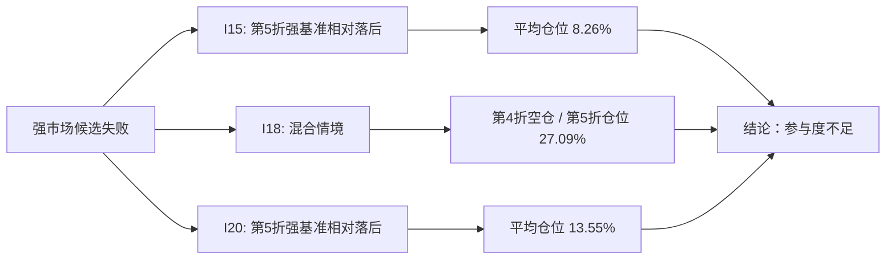

# Harness Iteration Brief - 2026-06-25 - I35 强市场候选沪深300权重归因

> 这份简报给人读，不替代原始 CSV、日志和 research-only 报告。它只解释历史研究样本，不生成交易建议，也不改变 admission 结论。

## 一句话结论

I15、I18、I20 三个“强沪深300参与型”候选仍然不能进入 paper review。共同问题不是缺少沪深300行情数据，而是策略在强指数阶段实际参与度太低：要么大部分时间空仓，要么只用很低仓位参与；即使参与，也覆盖的沪深300权重很少。

## 本轮做了什么

| 项目 | 内容 |
| ---- | ---- |
| 迭代编号 | `I35` |
| 任务性质 | research-only 失败归因 |
| 分析对象 | `strong_index_participation_v1`、`strong_index_participation_dynamic_trigger_v1`、`strong_market_liquid_breadth_participation_v1` |
| 证据链 | admission -> failure attribution -> market context -> holdings exposure -> CSI300 attribution |
| 权重口径 | 默认使用 `date - 1 day` 以前最近的 `cn_index_weights_asof`，不把同日收盘后权重当作事前可见 |
| admission 结论 | 三个候选仍为 `reject`；本轮不重跑准入、不放行模拟、不进入 watchlist |

## 关键数字

| 候选 | 折 | 市场状态 | 平均仓位 | 持有的沪深300权重 | 前20权重股覆盖率 | 策略收益 | 沪深300收益 | 超额 | 主要解释 |
| ---- | -: | -------- | -------: | ----------------: | ----------------: | -------: | ----------: | ---: | -------- |
| I15 `strong_index_participation_v1` | 5 | 强沪深300但策略落后 | 8.26% | 0.93% | 0.91% | 1.40% | 14.48% | -13.07% | 低参与度 |
| I18 `strong_index_participation_dynamic_trigger_v1` | 4 | 混合 / 未定 | 0.00% | 0.00% | 0.00% | 0.00% | 9.89% | -9.89% | 空仓 |
| I18 `strong_index_participation_dynamic_trigger_v1` | 5 | 混合 / 未定 | 27.09% | 3.54% | 5.83% | 8.33% | 14.48% | -6.14% | 参与不足 |
| I20 `strong_market_liquid_breadth_participation_v1` | 5 | 强沪深300但策略落后 | 13.55% | 1.68% | 1.79% | 4.20% | 14.48% | -10.28% | 低参与度 |

这些数字的意思很直接：这些策略不是“买错了一点点”，而是没有充分参与强指数行情。尤其 I15 和 I20 在第 5 折看起来是强市场候选，但实际整折平均仓位只有 8% 和 14% 左右。

## 为什么 I18 不能和 I15/I20 混成同一种失败

I15 和 I20 的第 5 折被标记为 `relative_lag_in_strong_benchmark_context`，可以直接解释为“沪深300强，但策略跟不上”。

I18 没有这个标签。它的第 4/5 折是 `mixed_or_unresolved_context`：第 4 折完全空仓，第 5 折有参与但仍低于基准。这说明 I18 的问题更像“动态触发器没有稳定解决参与度”，不能简单归因为同一种强指数相对落后。

## 最常遗漏的权重股

| 候选 | 常见遗漏 | 怎么理解 |
| ---- | -------- | -------- |
| I15 | 贵州茅台、宁德时代、中国平安、招商银行、中际旭创 | 第 5 折强沪深300阶段，高权重驱动覆盖很低 |
| I18 | 贵州茅台、宁德时代、中国平安、招商银行、美的集团 | 第 4 折完全空仓；第 5 折虽有交易但覆盖仍不足 |
| I20 | 贵州茅台、宁德时代、中国平安、招商银行、中际旭创 | 宽篮子改善了持仓数量，但没有真正覆盖指数权重 |

这些股票只是基准解释变量，不是买入建议。它们说明的是：沪深300上涨主要由这些高权重成分贡献时，候选策略没有跟上对应的权重暴露。

## 策略池影响

| 问题 | 结论 |
| ---- | ---- |
| 是否产生合格强市场策略 | 否 |
| 是否改变 I15/I18/I20 的 admission | 否，仍是 `reject` |
| 是否能进入 paper review | 否 |
| 是否能进入模拟账户、日报或 watchlist | 否 |
| 对策略池方法论的影响 | 强市场参与型角色仍缺候选；下一步不应继续微调触发器，而应重新预注册更直接的强指数参与假设 |

## 下一步建议

1. 暂停继续微调 I15/I18/I20 的触发器和过滤条件。
2. 预注册一个新候选：以“强市场中提高有效参与度”为核心目标，直接约束最低仓位、指数权重覆盖或流动性权重覆盖。
3. 新候选仍必须使用 point-in-time universe、`qfq_asof`、成本后回测和 admission gate；不能用事后知道的成分或同日收盘后权重。
4. 在策略选择方法论中保留本轮结论：强市场策略不是“名字叫强市场”就够，必须证明在强市场折里确实有足够仓位和权重覆盖。

## 原始证据

| 类型 | 路径 |
| ---- | ---- |
| I15 CSI300 归因 | `reports/strategy_governance/2026-06-25/main_strategy_rnd_harness/evidence/iter_35__strong_market_candidate_csi300_attribution/i15_csi300_attribution/` |
| I18 默认强滞后标签归因 | `reports/strategy_governance/2026-06-25/main_strategy_rnd_harness/evidence/iter_35__strong_market_candidate_csi300_attribution/i18_csi300_attribution/` |
| I18 mixed context 归因 | `reports/strategy_governance/2026-06-25/main_strategy_rnd_harness/evidence/iter_35__strong_market_candidate_csi300_attribution/i18_csi300_attribution_mixed_context/` |
| I20 CSI300 归因 | `reports/strategy_governance/2026-06-25/main_strategy_rnd_harness/evidence/iter_35__strong_market_candidate_csi300_attribution/i20_csi300_attribution/` |
| 持仓与暴露 | `reports/strategy_governance/2026-06-25/main_strategy_rnd_harness/evidence/iter_35__strong_market_candidate_csi300_attribution/i15_holdings_exposure/`、`i18_holdings_exposure/`、`i20_holdings_exposure/` |
| 测试结果 | `./.venv/bin/python -m pytest -s tests/test_index_asof_audit.py tests/test_strategy_holdings_exposure.py tests/test_strategy_csi300_attribution.py`，结果：`11 passed` |
