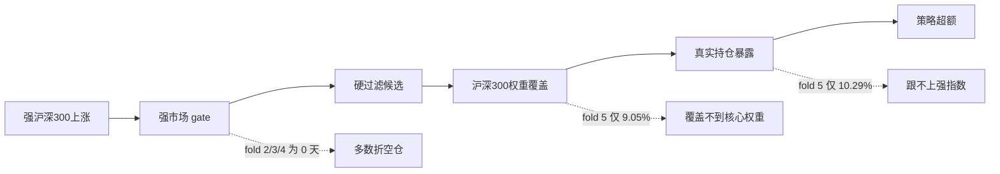

# Harness Iteration Brief - 2026-06-25 - I38 强市场候选池可达性诊断

## 一句话结论

强市场参与型策略当前失败，主要不是因为“组合权重器还不够聪明”，而是因为两件事同时发生：强市场 gate 在多数折里很少触发；触发以后，可买候选覆盖的沪深300核心权重也很低。

## 本轮做了什么

| 项目 | 内容 |
| ---- | ---- |
| 诊断对象 | `strong_market_effective_participation_v1` |
| 诊断性质 | research-only，只解释失败原因，不调参 |
| 配置 | `config.main_strategy_i37_strong_market_effective_participation_20260625.yaml` |
| 输入 | I37 修正后 admission folds |
| 输出 | fold summary、daily diagnostic、filter funnel、Markdown report |
| 新增字段 | 沪深300成分数、硬过滤后成分数、eligible benchmark weight、panel-visible Top20 eligible benchmark weight |

## 关键数字

| 折 | 强市场天数 | 有候选天数 | 平均候选数 | 强市场日可买沪深300权重 | 强市场日可买 panel Top20 权重 | 结论 |
| -: | ---------: | ---------: | ---------: | ----------------------: | ----------------------: | ---- |
| 1 | 7 / 243 | 7 / 243 | 0.52 | 11.18% | 5.79% | 强市场太少 |
| 2 | 0 / 243 | 0 / 243 | 0.00 | 0.00% | 0.00% | 没有强市场触发 |
| 3 | 0 / 241 | 0 / 241 | 0.00 | 0.00% | 0.00% | 没有强市场触发 |
| 4 | 0 / 241 | 0 / 241 | 0.00 | 0.00% | 0.00% | 没有强市场触发 |
| 5 | 61 / 242 | 61 / 242 | 4.16 | 9.05% | 3.93% | 有触发，但覆盖核心权重不足 |

第 5 折最关键：这是强沪深300上涨阶段，但强市场日平均可买候选只覆盖沪深300约 `9.05%` 权重，当前 panel 可见权重前20股票只覆盖约 `3.93%`。这不足以支撑“有效参与沪深300主升段”。

## 和 I37 结果如何对应

I37 修正后，第 5 折真实持仓归因显示：

| 指标 | 结果 |
| ---- | ---: |
| 平均实盘暴露 | 10.29% |
| 持有沪深300权重 | 2.13% |
| 前20权重股覆盖率 | 2.79% |
| 策略总收益 | -8.96% |
| 沪深300总收益 | 14.48% |
| 超额 | -23.43% |

I38 解释了为什么 I37 会这样：候选池里满足硬过滤和强市场状态的股票，本身就没有覆盖足够沪深300权重。组合权重器即使想提高仓位，也没有足够合格标的来承接。

注意：I38 的 `panel_top20_eligible_w` 是当前验证 panel 内按可见 benchmark weight 排名前20的口径，不是完整沪深300全成分 Top20。完整基准 Top20 可达性会放到 I40 的只读诊断里单独验证。

## 简单图示

## 本轮判断

强市场参与型角色仍然值得保留在策略池方法论里，因为项目需要覆盖不同市场环境。但当前这条实现路线不合格。

下一步不应继续做小参数调优。更合理的方向是重新设计候选生成层：

1. 先区分“强指数参与角色”和“主动选股角色”。
2. 对强指数参与角色，候选池必须优先保证 CSI300 核心权重可达性。
3. 对主动选股角色，再使用动量、残差、行业相对强弱等 alpha 过滤。
4. 如果强市场策略仍要求先过过窄硬过滤，就会天然错过沪深300核心权重股。

## 原始证据

| 类型 | 路径 |
| ---- | ---- |
| I38 filter diagnostic | `reports/strategy_governance/2026-06-25/main_strategy_rnd_harness/evidence/iter_38__strong_market_reachability_diagnostic/filter_diagnostic/` |
| fold summary | `reports/strategy_governance/2026-06-25/main_strategy_rnd_harness/evidence/iter_38__strong_market_reachability_diagnostic/filter_diagnostic/strategy_filter_fold_summary.csv` |
| daily diagnostic | `reports/strategy_governance/2026-06-25/main_strategy_rnd_harness/evidence/iter_38__strong_market_reachability_diagnostic/filter_diagnostic/strategy_filter_daily_diagnostic.csv` |
| I37 CSI300 attribution | `reports/strategy_governance/2026-06-25/main_strategy_rnd_harness/evidence/iter_37__strong_market_effective_participation/csi300_attribution_mixed_context/` |
