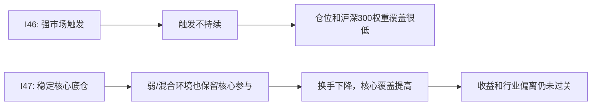

# Harness Iteration Brief - 2026-06-25 - I47 Strong Market Stable Core Base

> 这份简报给人读，不替代原始 CSV、日志和研究报告。它说明本轮发现了什么、证据是什么、下一步该怎么做。

## 一句话结论

I47 没有通过 admission，但它把问题往前推进了一步：稳定核心底仓显著降低了换手，并大幅提高了沪深300核心覆盖；剩下的问题是收益质量仍不够、强沪深300阶段仍低配、行业偏离更明显，不能进入 paper review。

## 本轮做了什么

| 项目 | 内容 |
| ---- | ---- |
| 迭代编号 | `iter_47` |
| 任务性质 | research-only scoped admission + holdings exposure + CSI300 attribution |
| 研究对象 | `strong_market_stable_core_base_v1` |
| 运行日期 | `2026-06-25` |
| 数据日期 | walk-forward 固定研究区间 `2019-04-01` 至 `2026-03-31` |
| 关键边界 | 不生成买卖建议；不进入 paper review；不进入模拟账户、日报或 watchlist；不降低 admission gate |

## 策略怎么变了

I46 的做法更像“强市场触发后再参与”。触发不够持续时，仓位会很低。

I47 改成“先有稳定核心底仓，再在强市场时加一点 alpha 卫星”。趋势、流动性、风险、行业约束不再硬过滤沪深300核心股，只用于排序、降权和审计。

## 关键数字

| 指标 | I46 | I47 | 怎么理解 |
| ---- | ----: | ----: | -------- |
| admission action | `reject` | `reject` | 两者都不能进入下一阶段 |
| 年化收益均值 | `-3.30%` | `-1.74%` | I47 亏损变小，但仍为负 |
| Sharpe | `-0.43` | `-0.34` | 风险收益仍不合格 |
| 正收益折比例 | `0%` | `40%` | 有改善，但低于 `75%` 门槛 |
| 正超额折比例 | `60%` | `40%` | I47 不比 I46 更会跑赢基准 |
| 年化换手均值 | `4.08` | `0.68` | I47 明显解决高换手问题 |
| 年化换手最大值 | `16.04` | `1.85` | 最大换手已低于门槛 |
| 平均实盘暴露 | `3.93%` | `36.58%` | 底仓机制有效提高参与度 |
| 策略权重中落在沪深300内的比例 | `3.15%` | `35.98%` | 核心指数覆盖显著提高 |
| Top20 覆盖率 | `3.66%` | `58.16%` | 核心高权重股覆盖明显提高 |
| 行业偏离 | `0.89` | `1.15` | 覆盖提高后行业结构偏离更明显，需要审计 |

## 结果意义

这轮不能说“找到了强沪深300策略”。更准确的结论是：I47 证明“稳定核心底仓”比 I46 的触发式参与更适合作为强市场参与机制，但当前首版底仓太保守，强沪深300环境下平均暴露约 `39%`，仍然跑不动强基准；同时行业偏离和 overfit 风险没有解决。

## 结论边界

| 问题 | 回答 |
| ---- | ---- |
| 是否改变 admission 结论 | 否，仍为 `reject` |
| 是否允许进入 paper review | 否，策略是 research-only 且未通过 gate |
| 是否可以进入模拟账户 / 日报 / watchlist | 否 |
| 是否说明核心股可达问题已解决 | 部分解决。I47 明显提高了核心覆盖，但不代表收益合格 |
| 是否说明 alpha 卫星有效 | 不能。当前没有证明卫星带来成本后稳定增益 |

## 下一步

1. I48 不做参数搜索，先做核心-only / 核心+卫星 / 卫星-only 三组拆分归因。
2. 如果核心-only 能稳定降低换手并提供可解释的基准参与，再评估卫星是否真的增益。
3. 如果卫星只增加噪声或行业偏离，应先停止卫星，改为研究“核心底仓暴露档位”而不是继续堆 alpha 条件。

## 原始证据

| 类型 | 路径 |
| ---- | ---- |
| admission 报告 | `reports/strategy_governance/2026-06-25/main_strategy_rnd_harness/evidence/iter_47__strong_market_stable_core_base/admission/strategy_admission_report.md` |
| holdings exposure 报告 | `reports/strategy_governance/2026-06-25/main_strategy_rnd_harness/evidence/iter_47__strong_market_stable_core_base/holdings_exposure/strategy_holdings_exposure_report.md` |
| CSI300 attribution 报告 | `reports/strategy_governance/2026-06-25/main_strategy_rnd_harness/evidence/iter_47__strong_market_stable_core_base/csi300_attribution_all_context/strategy_csi300_attribution_report.md` |
| 关键测试 | `./.venv/bin/python -m pytest -s tests/test_strong_market_stable_core_base_strategy.py tests/test_strong_market_core_participation_strategy.py tests/test_strategy_admission_config.py` |
