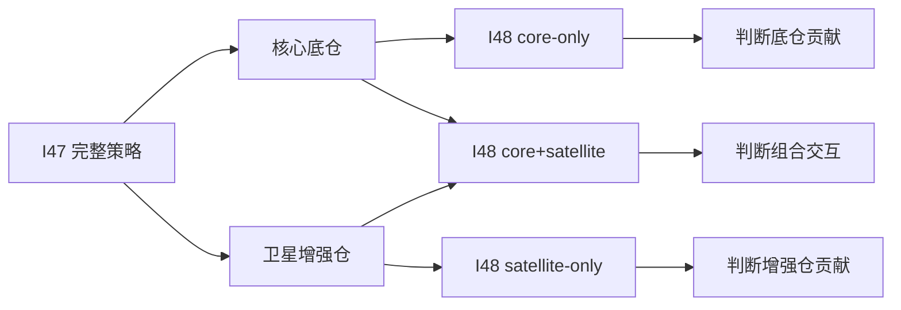

# Harness Iteration Brief - 2026-06-25 - I48 Stable Core Attribution

> 这份简报给人读，不替代原始 CSV、日志和研究报告。它说明本轮发现了什么、证据是什么、下一步该怎么做。

## 一句话结论

I48 没有找到可进入下一阶段的强沪深300策略。它把 I47 拆开后说明：I47 的改善主要来自“稳定核心底仓”，不是来自“卫星增强仓”。卫星增强在短窗口里有少数阶段性交易，但长窗口复核里基本没有稳定贡献。

## 本轮做了什么

| 项目 | 内容 |
| ---- | ---- |
| 迭代编号 | `iter_48` |
| 任务性质 | research-only scoped admission + long-window stability check |
| 研究对象 | `strong_market_stable_core_only_v1`、`strong_market_stable_core_base_v1`、`strong_market_stable_satellite_only_v1` |
| 运行日期 | `2026-06-25` |
| 数据日期 | walk-forward 固定研究区间至 `2026-03-31` |
| 数据源 | `local_history_sqlite_as_of`，价格口径 `qfq_asof` |
| 关键边界 | 不生成买卖建议；不进入 paper review；不进入模拟账户、日报或 watchlist；不降低 admission gate |

## 三个拆分版本是什么意思

| 版本 | 白话解释 | 用途 |
| ---- | -------- | ---- |
| `core-only` | 只保留沪深300核心底仓，不要外围增强股票 | 看稳定底仓本身有没有价值 |
| `core+satellite` | I47 原始版本：核心底仓 + 小比例外围增强仓 | 看完整组合表现 |
| `satellite-only` | 拿掉核心底仓，只保留外围增强仓 | 只做归因，不是实盘候选 |

`satellite-only` 的意思不是“建议单独买卫星仓”。它只是用来回答一个问题：I47 变好，到底是因为核心底仓，还是因为外围增强股票。

## preset 怎么读

| preset | 角色 | 本轮解释 |
| ------ | ---- | -------- |
| `baseline_2y_1y_5fold` | 短窗口横向对比 | 适合比较同一批策略谁相对更好，不适合作为最终稳定性证据 |
| `quality_3y_1y_4fold` | 3 年训练 + 1 年验证 | 用来复核更长训练期下结果是否还站得住 |
| `quality_4y_1y` | 4 年训练 + 1 年验证 | 更严格的长训练窗口，但折数少，只能作为补充稳定性证据 |

这次你的判断是对的：短窗口只适合策略之间横向对比。强沪深300核心底仓类策略必须补看长窗口，否则容易被最近一折误导。

## 短窗口结果

`baseline_2y_1y_5fold` 结果：

| 策略 | action | 年化收益 | Sharpe | 正收益折 | 正超额折 | 平均换手 | 怎么理解 |
| ---- | ------ | -------: | -----: | -------: | -------: | -------: | -------- |
| `core-only` | `reject` | `-1.99%` | `-0.35` | `40%` | `40%` | `0.68` | 底仓降低换手，但收益仍不合格 |
| `core+satellite` | `reject` | `-1.74%` | `-0.34` | `40%` | `40%` | `0.68` | 比 core-only 略好，但没有改变失败性质 |
| `satellite-only` | `reject` | `0.78%` | `0.14` | `40%` | `60%` | `1.21` | 有少数阶段性交易，但收益和稳定性仍不合格 |

短窗口里，`satellite-only` 在第 1 折和第 5 折有交易。第 1 折赚到约 `3.85%`，但主要发生在沪深300下跌期；第 5 折只有约 `0.05%`，同期沪深300约 `15.11%`。这不是稳定 alpha。

## 长窗口结果

`quality_3y_1y_4fold` 结果：

| 策略 | window pass | 年化收益 | Sharpe | 正收益折 | 正超额折 | 平均换手 | 怎么理解 |
| ---- | ----------- | -------: | -----: | -------: | -------: | -------: | -------- |
| `core-only` | `False` | `0.01%` | `-0.09` | `50%` | `25%` | `0.39` | 接近不赚钱，跑赢基准的折太少 |
| `core+satellite` | `False` | `0.01%` | `-0.09` | `50%` | `25%` | `0.39` | 与 core-only 基本一致 |
| `satellite-only` | `False` | `0.00%` | `0.00` | `0%` | `50%` | `0.00` | 基本没有有效交易 |

`quality_4y_1y` 结果：

| 策略 | window pass | 年化收益 | Sharpe | 正收益折 | 正超额折 | 平均换手 | 怎么理解 |
| ---- | ----------- | -------: | -----: | -------: | -------: | -------: | -------- |
| `core-only` | `True` | `6.22%` | `0.83` | `100%` | `0%` | `0.38` | 自己赚钱，但每折都跑输沪深300 |
| `core+satellite` | `True` | `6.22%` | `0.83` | `100%` | `0%` | `0.38` | 与 core-only 基本一致 |
| `satellite-only` | `False` | `0.00%` | `0.00` | `0%` | `0%` | `0.00` | 没有贡献 |

长窗口 admission 的最终动作：

| 策略 | 最终动作 | 原因 |
| ---- | -------- | ---- |
| `core-only` | `research_only` | 2 个长窗口里只通过 1 个；仍有行业集中审计问题；不支持 paper trade |
| `core+satellite` | `research_only` | 与 core-only 基本一致；只通过 1 个长窗口；不支持 paper trade |
| `satellite-only` | `reject` | overfit risk high，正收益折不足，基本无稳定交易 |

## 结果意义

这轮不能说“卫星增强有效”。更准确的结论是：

1. I47 的主要改善来自稳定核心底仓。
2. 卫星增强没有稳定、可复核的独立贡献。
3. 长窗口下核心底仓有低换手和低回撤优点，但相对沪深300仍弱。
4. 4+1 窗口能赚钱，说明方向不是完全无效；但 3+1 没通过，且正超额折不足，不能进入 paper review。

## 结论边界

| 问题 | 回答 |
| ---- | ---- |
| 是否改变 admission 结论 | 没有。没有候选进入正式下一阶段 |
| 是否允许进入 paper review | 否 |
| 是否可以进入模拟账户 / 日报 / watchlist | 否 |
| 是否证明核心底仓机制有价值 | 有研究价值，尤其是低换手和低回撤，但还不是合格策略 |
| 是否证明卫星增强有效 | 否。当前应停止围绕卫星增强继续小参数调优 |
| 是否说明 2+1 preset 不该用 | 不是。2+1 仍用于横向比较，但不能单独作为稳定性结论 |
| 是否处理了弱转强入场延迟 | 是。本轮最终 rerun 已修正空仓后强市场出现时立即重试入场 |

## 下一步

1. I49 不继续调 `satellite-only`，先停止卫星增强小参数路线。
2. 下一轮应围绕核心底仓做“相对沪深300跑输归因”：看问题来自核心暴露不够、行业偏离、权重贴近度不足，还是强市场识别太晚。
3. 如果要继续核心底仓方向，应先做受控的核心暴露档位 / 行业贴近度实验，而不是直接把仓位拉满。

## 原始证据

| 类型 | 路径 |
| ---- | ---- |
| 短窗口 admission 报告 | `reports/strategy_governance/2026-06-25/main_strategy_rnd_harness/evidence/iter_48__stable_core_attribution_final_rerun/admission_short/strategy_admission_report.md` |
| 长窗口 admission 报告 | `reports/strategy_governance/2026-06-25/main_strategy_rnd_harness/evidence/iter_48__stable_core_attribution_final_rerun/admission_long/strategy_admission_report.md` |
| 短窗口 window matrix | `reports/strategy_governance/2026-06-25/main_strategy_rnd_harness/evidence/iter_48__stable_core_attribution_final_rerun/admission_short/strategy_admission_window_matrix.csv` |
| 长窗口 window matrix | `reports/strategy_governance/2026-06-25/main_strategy_rnd_harness/evidence/iter_48__stable_core_attribution_final_rerun/admission_long/strategy_admission_window_matrix.csv` |
| 关键测试 | `./.venv/bin/python -m pytest -s tests/test_strong_market_stable_core_base_strategy.py tests/test_strategy_admission_config.py` |
